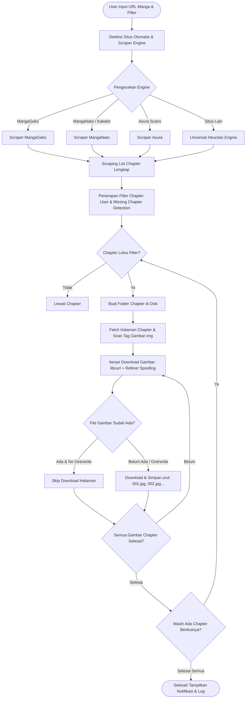

<div align="center">

  

  <br/><br/>

  <p align="center">
    
  </p>

  # ⚡ MANGA DOWNLOADER ⚡
  ### *High-Performance, Ultra-Lightweight Native Win32 Manga Archiver & AI Hub*

  <p align="center">
    <b>Aplikasi Desktop C Murni untuk Mengunduh Seluruh Chapter Manga Secara Otomatis, Rapi, Cepat, dan Hemat Memori.</b>
  </p>

  <p align="center">
    <a href="README.md"></a>
    <a href="README.id.md"></a>
  </p>

  <p align="center">
    <a href="https://github.com/gcmaniac/manga_downloader"></a>
    <a href="https://github.com/gcmaniac/manga_downloader/stargazers"></a>
    <a href="#-fitur-utama"></a>
    <a href="#️-panduan-instalasi--setup-untuk-programmer-baru"></a>
    <a href="#️-panduan-instalasi--setup-untuk-programmer-baru"></a>
    <a href="#️-panduan-instalasi--setup-untuk-programmer-baru"></a>
    <a href="LICENSE"></a>
    <a href="#️-panduan-instalasi--setup-untuk-programmer-baru"></a>
  </p>

  <p align="center">
    <a href="#-tentang-projek">📖 Tentang</a> •
    <a href="#-alur-sistem--cara-kerja">🔄 Alur Sistem</a> •
    <a href="#-user-guide--panduan-penggunaan">🚀 Panduan Penggunaan</a> •
    <a href="#-fitur-utama">✨ Fitur Utama</a> •
    <a href="#️-panduan-instalasi--setup-untuk-programmer-baru">🛠️ Panduan Developer</a> •
    <a href="#-undangan-kontribusi-call-for-contribution">🤝 Kontribusi</a> •
    <a href="#-lisensi">📄 Lisensi</a>
  </p>

</div>

---

## 📖 Tentang Projek

**Manga Downloader** adalah aplikasi desktop native Windows yang dibangun secara spesifik menggunakan bahasa pemrograman **C** dan **Windows Win32 API**. Aplikasi ini dirancang dari awal untuk memecahkan masalah umum yang sering ditemui pada manga downloader modern: *konsumsi RAM berlebih (Chromium/Electron bloatware), proses unduhan lambat, dan struktur folder yang berantakan*.

Dengan ukuran binary yang sangat ringkas (**kurang dari 250 KB**) dan penggunaan memori RAM yang sangat hemat (**< 20 MB RAM**), Anda dapat mengarsipkan ribuan chapter manga berkualitas tinggi ke dalam penyimpanan lokal secara tenang tanpa membebani kinerja laptop atau komputer Anda.

### 🌟 Mengapa Memilih Manga Downloader?
* **Zero Bloatware**: Dibuat murni dengan C (bukan Electron, bukan WebView, bukan Python GUI runtime).
* **Portable Ready**: Cukup ekstrak satu folder ZIP dan langsung jalankan tanpa installer atau registri Windows yang rumit.
* **Smart Heuristics Engine**: Mampu membaca pola halaman chapter dan link gambar secara otomatis dari berbagai portal manga terkemuka.
* **Next-Gen AI Agent Hub**: Terintegrasi langsung dengan database model AI (OpenRouter API) untuk benchmarking latensi, pricing per million token, rating kecerdasan, dan persiapan otomatisasi masa depan.

---

## 🔄 Alur Sistem & Cara Kerja

Di bawah ini adalah diagram arsitektur alur kerja bagaimana Manga Downloader bekerja mulai dari penerimaan URL manga hingga penyimpanan gambar ke folder disk:



### 🔍 Tahapan Eksekusi Internal:

1. **URL Normalization & Engine Selector**
   Sistem mengekstrak base hostname dan mencocokkan pola regex-free dengan daftar provider yang didukung. Jika tidak terdaftar, mesin *Universal Heuristic Engine* otomatis aktif.
2. **Chapter Discovery & Indexing**
   Mengambil HTML indeks manga, mengekstrak tag tautan chapter (`/reader/`, `/chapter-`, dll.), menyortir secara kronologis (Chapter 1 hingga akhir), dan mengeliminasi duplikasi tautan.
3. **Smart Range & Missing Chapter Filter**
   Menerapkan ekspresi rentang yang dimasukkan pengguna (misal: `1-10, 25, 50-end`). Jika opsi *"Hanya cari & download chapter yang belum ada"* aktif, program memeriksa keberadaan folder lokal dan memastikan ada file gambar di dalamnya sebelum memutuskan untuk melompati chapter tersebut.
4. **Resilient Image Fetching (Anti-Hotlinking)**
   Mengirimkan HTTP request dengan peniruan header browser asli (`User-Agent Chrome Windows 10/11`) serta menyertakan `Referer Header` halaman chapter terkait agar terhindar dari pemblokiran *HTTP 403 Forbidden* oleh Content Delivery Network (CDN) situs manga.
5. **Disk Write & Real-Time Logging**
   Setiap progres halaman dan chapter dilaporkan langsung ke jendela log Win32 UI di thread terpisah (`Background Worker Thread`) sehingga tampilan grafis tetap responsif, bebas *freeze* (*Not Responding*).

---

## ✨ Fitur Utama

| Fitur | Deskripsi |
| :--- | :--- |
| **🚀 Native Win32 UI** | Antarmuka grafis yang super cepat, ringan, responsif, dan hemat baterai tanpa runtime tambahan. |
| **🎯 Multi-Site Scraper Engine** | Dukungan siap pakai untuk **MangaGeko**, **MangaNato**, **MangaKakalot**, **Asura Scans**, serta **Universal Scraper** untuk situs manga berbasis web reader standar. |
| **🔢 Filter Chapter Fleksibel** | Dukungan pemilihan chapter spesifik maupun rentang, misalnya: `5`, `1-10`, `25, 28, 30`, atau `116-end`. |
| **🛡️ Deteksi Chapter Belum Ada** | Mencegah download berulang jika Anda mengunduh manga yang sedang berjalan (*ongoing*). Cukup centang opsi ini dan program hanya mengunduh chapter baru! |
| **⚡ Multi-Threaded Async Worker** | Download berjalan di latar belakang tanpa mengunci antarmuka program, dilengkapi tombol **Stop** yang responsif sewaktu-waktu. |
| **📁 Tata Kelola Folder Otomatis** | Gambar disimpan rapi per subfolder chapter dengan penomoran terurut (`001.jpg`, `002.jpg`, ...) sehingga nyaman dibaca dengan pembaca manga offline mana pun. |
| **📄 Konverter PDF Cerdas** | Konversi chapter yang diunduh ke dokumen PDF (per chapter atau per volume). Mendukung pemindahan folder chapter ke volume otomatis dan parsing daftar volume via AI Agent. |
| **🌐 Penerjemah Manga AI** | Pipeline penerjemahan visual berbasis Vision LLM. Otomatis mendeteksi balon dialog (speech bubbles), menghapus teks asli (in-painting), dan mengetik ulang teks terjemahan (ID/EN/JP) dengan font proporsional, serta opsi ekspor langsung ke PDF. |
| **🔔 Notifikasi Suara** | Memainkan suara lonceng notifikasi Windows saat proses download, konversi PDF, maupun translasi selesai. |
| **🧠 Built-in AI Agent Hub** | Manajemen database lokal SQLite untuk integrasi AI (OpenRouter API), mendukung pengujian ratusan model AI, perbandingan biaya token, latensi, dan ranking kecerdasan. |
| **📦 100% Portable** | Bebas dipindahkan ke USB Flashdisk atau drive eksternal, siap jalan di Windows 10 dan Windows 11. |

---

## 🚀 User Guide / Panduan Penggunaan

### 1. Menjalankan Aplikasi (1-Klik Siap Pakai)
* **Cara Cepat (1-Klik)**: Cukup klik ganda **`Jalankan_App.bat`** atau langsung file **`manga_downloader.exe`** di folder utama.
* Seluruh dependensi pustaka (`libcurl`, `sqlite3`, `cjson`, dll.) dan database SQLite sudah terkonfigurasi secara portabel di dalam folder sehingga langsung berjalan seketika tanpa perlu instalasi atau setup tambahan.
* Jika mendistribusikan ke komputer lain, gunakan file zip mandiri dari menu [Releases](https://github.com/gcmaniac/manga_downloader/releases) atau paketkan ulang dengan `package.bat`.

### 2. Mengunduh Manga (Tab 1: Home)
1. **Link Utama Manga**:
   Salin link daftar chapter manga yang ingin Anda unduh dari browser, lalu tempelkan ke kolom *Link Utama Manga*.
   > Contoh: `https://www.mgeko.cc/manga/7322-parnf/all-chapters/`
2. **Status Web**:
   Perhatikan indikator status di bawah kolom URL. Aplikasi akan langsung mendeteksi engine scraper yang sesuai (misal: *MangaGeko Engine [Didukung]*).
3. **Folder Penyimpanan**:
   Klik tombol **Browse...** untuk memilih folder tujuan di komputer Anda (atau klik tombol **Default** untuk menyimpan di subfolder `downloads`).
4. **Pilih Chapter (Opsional)**:
   * Kosongkan kolom jika Anda ingin mengunduh **seluruh chapter dari awal sampai akhir**.
   * Jika hanya ingin chapter tertentu, masukkan format angka seperti:
     * `1-10` : Mengunduh chapter 1 sampai chapter 10.
     * `5, 12, 20` : Mengunduh hanya chapter 5, 12, dan 20.
     * `100-end` : Mengunduh dari chapter 100 sampai chapter paling baru yang rilis.
5. **Opsi Tambahan**:
   * Centang **"Hanya cari & download chapter yang belum ada di folder"** jika Anda hanya ingin memperbarui chapter terbaru manga tanpa mendownload ulang chapter lama.
   * Centang **"Timpa file jika sudah ada"** hanya jika Anda ingin mereplace file lama.
6. **Mulai Download**:
   * Klik tombol **Start Download**.
   * Pantau proses pengunduhan secara langsung pada kotak **Log Aktivitas**.
   * Anda dapat membatalkan proses kapan saja dengan mengklik tombol **Stop**.

---

### 3. Konversi ke PDF (Tab 2: Konversi PDF)
* Pilih antara **Per Chapter (1 PDF per chapter)** atau **Per Volume (1 PDF per volume)**.
* Pengelompokan volume dapat menggunakan daftar volume custom atau menetapkan jumlah chapter tetap per volume.
* Secara otomatis memindahkan chapter ke dalam folder volume terstruktur dan menghasilkan buku PDF rapi.

---

### 4. Terjemahan Manga Visual (Tab 3: Terjemahan Manga)
* **Alur Penerjemahan Visual**:
  1. Pilih folder yang berisi chapter manga yang sudah didownload.
  2. Tentukan bahasa tujuan (**Bahasa Indonesia**, **English**, atau **Japanese**).
  3. Filter rentang chapter yang ingin diterjemahkan (contoh: `1-5`).
  4. Opsi hasil:
     * **Simpan gambar hasil terjemahan**: Menyimpan halaman baru ke `[Folder Target]\Chapter XXX [ID]\...`
     * **Satukan langsung ke format PDF**: Mengompilasi gambar terjemahan langsung menjadi file PDF siap baca.
  5. Vision LLM (`server_agent` + `model_penggunaan`) akan memindai tiap halaman, mendeteksi lokasi balon teks, menghapus teks asli, lalu mengetikkan teks terjemahan secara rapi dan otomatis menyesuaikan ukuran font.

#### ⚠️ Keterbatasan & Batasan Fungsi Translasi:
* **Kebutuhan Model Vision (Multimodal)**: Fitur translasi memerlukan model AI yang mendukung input gambar (*Vision*). Model berbasis teks saja tidak dapat mengenali posisi balon teks. Model gratis di OpenRouter dapat berubah ketersediaannya sewaktu-waktu atau terkena batas kuota (aplikasi sudah dilengkapi sistem failover otomatis ke model cadangan di Tab 6).
* **Pembersihan Latar Belakang (In-Painting)**: Hasil paling optimal didapatkan pada balon percakapan standar dengan latar putih atau warna polos. Teks yang tertulis langsung di atas ilustrasi rumit, efek bayangan gelap, screentone, atau gradasi (*text over art*) dapat meninggalkan bekas masking solid.
* **Efek Suara Gambar / SFX (Onomatopoeia)**: Tulisan efek suara artistik (*hand-drawn SFX* / huruf Jepang katakana di luar balon dialog) biasanya dilewati oleh sistem dan tidak diterjemahkan agar tidak merusak artwork manga.
* **Orientasi Teks Vertikal vs Horizontal**: Teks manga asli Jepang umumnya tersusun vertikal dari atas ke bawah. Teks terjemahan (Indonesia/Inggris) ditulis horizontal dari kiri ke kanan. Pada balon dialog vertikal yang sangat sempit, penyesuaian font otomatis (*auto-scaling*) akan mengecilkan ukuran huruf agar seluruh kalimat tetap muat di dalam kotak dialog.
* **Latensi Jaringan & Ukuran Gambar**: Tiap gambar halaman dikirim dalam bentuk Base64 ke server AI. Kecepatan penerjemahan bergantung pada koneksi internet dan kecepatan respons model AI (rata-rata 2–5 detik per halaman). Format webtoon memanjang (*long strip*) membutuhkan pemrosesan lebih lama dibandingkan halaman buku komik standar.

---

### 5. Menggunakan Fitur AI Hub (Tab 4, 5, & 6)

Aplikasi ini menyertakan panel evaluasi AI canggih berbasis SQLite untuk riset dan otomatisasi:

* **Tab 4 (Pengaturan & Uji AI)**:
  * Masukkan API Key dari [OpenRouter](https://openrouter.ai/).
  * Klik tombol **Scan & Perbarui Model**. Aplikasi akan mengambil daftar lengkap model AI, menghitung estimasi latensi, serta harga input/output token.
  * Lakukan pengurutan (Sorting) ganda berdasarkan Rating, Latensi, atau Harga.
* **Tab 5 (Katalog Model Teruji)**:
  * Filter model berdasarkan rentang harga atau rating tertentu.
  * Pilih model terbaik untuk didaftarkan ke daftar model operasional dengan menekan tombol **Gunakan Model Ini**.
* **Tab 6 (Model AI Digunakan)**:
  * Kelola prioritas urutan model AI aktif yang siap dikonfigurasikan untuk kebutuhan analisis dan translasi chapter.

---

## 🛠️ Panduan Instalasi & Setup untuk Programmer Baru

Selamat datang di tim pengembang **Manga Downloader**! Panduan ini disusun untuk memandu programmer yang baru pertama kali melakukan `git clone` agar dapat menyiapkan seluruh dependensi, mengompilasi kode sumber, dan menjalankan aplikasi secara lancar.

### 📋 Prasyarat & Kebutuhan Sistem

* **Sistem Operasi**: Windows 10 atau Windows 11 (arsitektur 64-bit direkomendasikan).
* **Git**: [Git for Windows](https://git-scm.com/) terpasang dan dapat diakses dari Command Prompt atau PowerShell.
* **Terminal**: Windows Terminal, Command Prompt (`cmd.exe`), atau PowerShell.

---

### 📦 Toolchain Kompilasi & Pustaka Dependensi

Manga Downloader dibangun menggunakan standar bahasa **C99 murni** dan **Win32 API native** tanpa framework berat. Untuk mengompilasinya di Windows, Anda memerlukan toolchain **MSYS2 MinGW-w64 (64-bit)**.

#### 1. Daftar Paket & Library yang Dibutuhkan

| Nama Paket MSYS2 | Kegunaan | Perintah Instalasi |
| :--- | :--- | :--- |
| **`mingw-w64-x86_64-toolchain`** | GNU C Compiler (`gcc`), Resource Compiler (`windres`), Binutils, Make | `pacman -S mingw-w64-x86_64-toolchain` |
| **`mingw-w64-x86_64-curl`** | Komunikasi jaringan HTTP/HTTPS, custom headers, referer anti-hotlink | `pacman -S mingw-w64-x86_64-curl` |
| **`mingw-w64-x86_64-sqlite3`** | Basis data model AI, pencatatan latensi, dan statistik performa | `pacman -S mingw-w64-x86_64-sqlite3` |
| **`mingw-w64-x86_64-cjson`** | Parser JSON ringan untuk API OpenRouter dan file bahasa i18n | `pacman -S mingw-w64-x86_64-cjson` |
| **Windows Native SDK** | Win32 GUI (`comctl32`), GDI (`gdi32`), WIC (`windowscodecs`), Shell (`shell32`), COM (`ole32`, `oleaut32`) | Sudah terpasang otomatis bersama MinGW CRT & Windows |

---

### 🚀 Panduan Langkah-demi-Langkah Instalasi (First Clone)

Ikuti langkah-langkah di bawah ini secara berurutan:

#### Langkah 1: Unduh dan Pasang MSYS2
1. Unduh installer MSYS2 dari situs resminya: **[https://www.msys2.org/](https://www.msys2.org/)**.
2. Pasang ke direktori default yang disarankan: `C:\msys64`.

#### Langkah 2: Pasang Compiler Toolchain & Libraries
Buka terminal **MSYS2 MinGW x64** (cari *"MSYS2 MinGW 64-bit"* di Windows Start Menu), lalu jalankan perintah berikut:
```bash
pacman -Syu --noconfirm
pacman -S --needed --noconfirm base-devel mingw-w64-x86_64-toolchain mingw-w64-x86_64-curl mingw-w64-x86_64-sqlite3 mingw-w64-x86_64-cjson
```

#### Langkah 3: Tambahkan MinGW64 ke System PATH Windows
Agar skrip `build.bat` dan Command Prompt / PowerShell mengenali perintah `gcc` dan `windres`:
1. Tekan tombol `Win + R`, ketik `sysdm.cpl`, lalu tekan Enter.
2. Masuk ke tab **Advanced** -> klik tombol **Environment Variables**.
3. Pada bagian **System variables** (atau **User variables**), pilih variabel `Path` lalu klik **Edit**.
4. Klik tombol **New** dan tambahkan path berikut:
   ```text
   C:\msys64\mingw64\bin
   ```
5. Klik **OK** pada semua jendela dialog untuk menyimpan perubahan.
6. Buka jendela Command Prompt (`cmd.exe`) atau PowerShell baru, lalu verifikasi:
   ```cmd
   gcc --version
   windres --version
   ```
   *(Pastikan kedua perintah menampilkan versi GCC dan GNU Binutils 12+ atau 13+).*

#### Langkah 4: Clone Repositori Git
Clone repositori ke komputer Anda dan masuk ke direktori proyek:
```cmd
git clone https://github.com/gcmaniac/manga_downloader.git
cd manga_downloader
```

#### Langkah 5: Kompilasi Proyek
Jalankan skrip build otomatis:
```cmd
build.bat
```

Apa yang dilakukan oleh `build.bat` secara otomatis:
1. **Deteksi Otomatis Lingkungan**: Mencari compiler GCC di `PATH` dan direktori umum MSYS2 (`C:\msys64\mingw64`, `D:\msys64\mingw64`, `E:\msys64\mingw64`).
2. **Kompilasi Resources**: Mengompilasi `resources.rc` menjadi `dist\resources.o` yang berisi ikon resolusi tinggi dan manifest Windows Modern Controls.
3. **Kompilasi Modul C**: Mengompilasi semua file sumber C di `src/` dan `src/scrapers/` dengan optimasi `-Wall -O2` menjadi `dist\manga_downloader.exe`.
4. **Penyalinan File Runtime**: Otomatis menyalin semua file DLL pendukung (`libcurl-4.dll`, `libsqlite3-0.dll`, `libcjson-1.dll`, dll.), folder file bahasa (`src\lang\*.json`), dan database SQLite ke dalam folder `dist\`.

#### Langkah 6: Jalankan dan Uji Coba Aplikasi
Setelah kompilasi selesai, aplikasi siap dijalankan:
* Menggunakan skrip peluncur 1-klik:
  ```cmd
  Jalankan_App.bat
  ```
* Atau jalankan file binary secara langsung:
  ```cmd
  dist\manga_downloader.exe
  ```

---

### 🏗️ Struktur Direktori & Arsitektur Kode Sumber

Peta struktur direktori untuk mempermudah Anda menjelajahi basis kode:

```text
manga_downloader/
├── assets/                    # Aset grafis (banner, icon aplikasi .ico & .png)
├── dist/                      # Direktori output build (executable, DLL runtime, DB SQLite, lang/)
│   ├── manga_downloader.exe   # Binary aplikasi Windows native dinamis
│   ├── manga_downloader.db    # Database SQLite tersemat (katalog & benchmark model AI)
│   ├── config.ini             # Konfigurasi aplikasi (bahasa terpilih, API key, folder unduhan)
│   └── lang/                  # File JSON lokalisasi bahasa terdistribusi
├── downloads/                 # Folder tujuan default hasil download chapter manga
├── src/                       # Kode sumber utama aplikasi (C99 / Win32)
│   ├── main.c                 # Entry point Win32 GUI, Tab control, event loop, worker thread
│   ├── ai_agent.c             # AI Hub, klien OpenRouter API, benchmark latensi, failover model
│   ├── pdf_converter.c        # Mesin rendering PDF native Windows GDI/WIC (per chapter & per volume)
│   ├── manga_translator.c     # Pipeline translasi Vision LLM, deteksi bubble & typesetting teks
│   ├── db_migration.c         # Skema inisialisasi dan migrasi tabel SQLite
│   ├── config.c               # Pemuat dan penyimpan konfigurasi portabel (config.ini)
│   ├── lang.c                 # Pemuat internasionalisasi multi-bahasa (JSON i18n)
│   ├── lang/                  # File definisi bahasa sumber
│   │   ├── id.json            # String bahasa Indonesia
│   │   ├── en.json            # String bahasa Inggris
│   │   └── ja.json            # String bahasa Jepang
│   └── scrapers/              # Modul parser scraper situs manga
│       ├── scrapers.h         # Definisi tipe dan antarmuka standar scraper
│       ├── scrapers.c         # Dispatcher scraper dan fungsi utilitas HTML parser bersama
│       ├── scraper_manganato.c# Parser untuk portal Manganato & MangaKakalot
│       ├── scraper_mgeko.c    # Parser untuk portal MangaGeko
│       ├── scraper_asura.c    # Parser untuk portal Asura Scans
│       └── scraper_generic.c  # Parser heuristik universal untuk web reader umum lainnya
├── build.bat                  # Skrip utama kompilasi Windows
├── package.bat                # Skrip pembuat arsip distribusi portable ZIP
├── Jalankan_App.bat           # Skrip peluncur instan 1-klik
├── resources.rc               # Resource Windows (ikon aplikasi & manifest styles)
└── LICENSE                    # Lisensi Open Source MIT
```

---

### ⚙️ Target Build Lanjutan

| Perintah | Output | Keterangan |
| :--- | :--- | :--- |
| `build.bat` | `dist\manga_downloader.exe` | Kompilasi dinamis standar bersama file DLL. Sangat cepat (~3-5 detik). |
| `build.bat --static` | `dist\manga_downloader_standalone.exe` | Binary mandiri (*standalone*) statis penuh. Semua dependensi di-link secara statis tanpa butuh DLL eksternal. |
| `build.bat --no-pause` | `dist\manga_downloader.exe` | Kompilasi tanpa jeda konfirmasi (cocok untuk skrip otomatisasi / CI). |
| `package.bat` | `dist\manga_downloader_portable.zip` | Mengompilasi dan mengemas seluruh distribusi portabel siap edar. |

---

### 🧩 Panduan Mengembangkan & Menambah Fitur Baru

#### Menambahkan Parser / Scraper Situs Baru:
1. Buat file sumber baru di `src/scrapers/scraper_<namasitus>.c`.
2. Implementasikan fungsi ekstraksi list chapter dan link gambar sesuai kontrak struct `ScraperEngine` pada `src/scrapers/scrapers.h`.
3. Daftarkan scraper baru pada dispatcher di `src/scrapers/scrapers.c` dan detektor URL di `src/main.c`.
4. Tambahkan file `.c` baru tersebut ke dalam variabel `set SRCS=...` di `build.bat`.

#### Menambahkan Terjemahan Bahasa GUI Baru:
1. Buat file JSON baru di `src/lang/<kode>.json` (misal `es.json` untuk Bahasa Spanyol).
2. Terjemahkan pasangan key-value sesuai struktur referensi di `src/lang/en.json`.
3. Daftarkan kode bahasa baru ke dalam daftar bahasa di `src/lang.c` dan UI pilihan bahasa di `src/main.c`.

---

### ❓ Solusi Masalah Umum (Troubleshooting)

#### 1. Perintah `'gcc'` atau `'windres'` tidak dikenali (*not recognized*)
* **Penyebab**: Folder `bin` MinGW belum dimasukkan ke variabel lingkungan `PATH` Windows.
* **Solusi**: Tambahkan `C:\msys64\mingw64\bin` ke `PATH` Windows dan buka ulang jendela command prompt.

#### 2. Error `fatal error: curl/curl.h: No such file or directory` (atau `sqlite3.h` / `cjson/cJSON.h`)
* **Penyebab**: Paket library pengembangan belum terpasang di MSYS2.
* **Solusi**: Buka terminal MSYS2 MinGW 64-bit dan jalankan:
  ```bash
  pacman -S mingw-w64-x86_64-curl mingw-w64-x86_64-sqlite3 mingw-w64-x86_64-cjson
  ```

#### 3. Error file DLL tidak ditemukan saat aplikasi dijalankan
* **Penyebab**: Menjalankan file `.exe` di luar folder `dist/` tempat DLL runtime berada.
* **Solusi**: Jalankan aplikasi dari dalam folder `dist/` atau gunakan file `Jalankan_App.bat`.

#### 4. Respon AI mengalami error atau `unavailable for free`
* **Penyebab**: Tier ketersediaan model pada penyedia OpenRouter berubah atau terkena pembatasan kuota sementara.
* **Solusi**: Buka Tab 4 untuk memindai ulang model atau pilih model alternatif di Tab 5/6. Fitur failover otomatis pada aplikasi akan secara pintar mengalihkan permintaan ke kandidat model aktif berikutnya.

---

## 🤝 Undangan Kontribusi (Call for Contribution)

<div align="center">
  <h3>🌸 Mari Berkembang Bersama Komunitas Open Source! 🌸</h3>
  <p>
    <i>"Projek ini dibangun dengan dedikasi untuk kesederhanaan, kecepatan, dan kebebasan mengarsipkan karya manga favorit."</i>
  </p>
</div>

Kami sangat membuka pintu selebar-lebarnya bagi siapa saja—baik pemula, antusias bahasa C, maupun pengembang berpengalaman—untuk ikut serta mengembangkan **Manga Downloader**!

### 💡 Ide Kontribusi yang Sangat Dinantikan:
- [x] **Penambahan Scraper Baru**: Didukung bawaan untuk MangaGeko, MangaNato, dan Asura Scans. (Dukungan portal lain sangat dinantikan!)
- [x] **Fitur Export PDF**: Ekspor PDF per chapter dan per volume secara cepat dengan penataan folder otomatis.
- [x] **AI-Powered Visual Translator**: Pipeline Vision LLM untuk deteksi balon percakapan, penghapusan teks asli, dan perapian teks terjemahan otomatis.
- [x] **Lokalisasi Bahasa GUI**: Dukungan multi-bahasa antarmuka (Bahasa Indonesia, English, 日本語) berbasis file JSON.
- [ ] **Multi-threaded Worker Pool**: Mempercepat proses download dengan mengunduh beberapa gambar atau chapter secara paralel secara simultan.
- [ ] **Dark Mode Win32 Theme**: Menambahkan opsi tema gelap native Windows yang elegan.
- [ ] **Ekspor Komik CBZ**: Pilihan pembuatan arsip komik `.cbz` langsung selain dokumen PDF.

### 🛠️ Alur Mengirimkan Kontribusi (Pull Request):
1. **[Fork](https://github.com/gcmaniac/manga_downloader/fork)** repositori ini ke akun GitHub Anda.
2. Buat branch fitur baru yang deskriptif:
   ```bash
   git checkout -b fitur/tambah-scraper-web-baru
   ```
3. Lakukan perubahan kode dan pastikan program dapat dikompilasi dengan lancar melalui `build.bat`:
   ```cmd
   build.bat
   ```
4. Commit perubahan Anda dengan pesan yang jelas:
   ```bash
   git commit -m "feat: Menambahkan scraper engine untuk situs KomikXYZ"
   ```
5. Push branch Anda ke repository fork:
   ```bash
   git push origin fitur/tambah-scraper-web-baru
   ```
6. Buka **[Pull Request](https://github.com/gcmaniac/manga_downloader/pulls)** di GitHub dan jelaskan fitur atau perbaikan yang Anda tawarkan. Kami akan meninjau dan menggabungkannya dengan senang hati!

Jika Anda menemukan bug atau memiliki ide perbaikan, jangan ragu untuk membuka **[Issue Baru di GitHub](https://github.com/gcmaniac/manga_downloader/issues)**!

---

## ⚖️ Disclaimer & Etika Penggunaan

Projek ini dibuat murni untuk tujuan edukasi, pembelajaran pemrograman sistem dengan bahasa C & Win32 API, serta pengarsipan pribadi (*personal backup/archiving*). Mohon dukung terus para mangaka, author, ilustrator, dan penerbit resmi dengan membeli karya original, merchandise, maupun berlangganan di platform legal resmi.

---

## 📄 Lisensi

Projek ini dirilis di bawah naungan **[MIT License](LICENSE)**. Anda bebas menggunakan, memodifikasi, dan mendistribusikannya baik untuk keperluan non-komersial maupun komersial dengan tetap menyertakan atribusi lisensi asli.

---

<div align="center">
  <sub>Dibangun dengan ❤️ dan dedikasi oleh <a href="https://github.com/gcmaniac"><b>gcmaniac</b></a> bersama komunitas pecinta Manga & Open Source.</sub><br/><br/>
  <b>⭐ Jangan lupa berikan <a href="https://github.com/gcmaniac/manga_downloader">Star di GitHub</a> jika aplikasi ini bermanfaat untuk Anda! ⭐</b>
</div>
