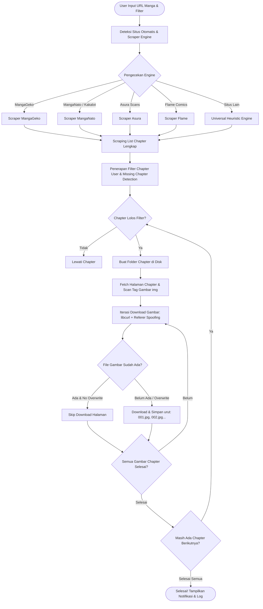

<div align="center">

  

  <br/><br/>

  <p align="center">
    
  </p>

  # ⚡ MANGA DOWNLOADER ⚡
  ### *High-Performance, Ultra-Lightweight Native Win32 Manga Archiver & AI Hub*

  <p align="center">
    <b>Aplikasi Desktop C Murni untuk Mengunduh Seluruh Chapter Manga Secara Otomatis, Rapi, Cepat, dan Hemat Memori.</b>
  </p>

  <p align="center">
    <a href="https://github.com/gcmaniac/manga_downloader"></a>
    <a href="https://github.com/gcmaniac/manga_downloader/stargazers"></a>
    <a href="#-fitur-utama"></a>
    <a href="#-spesifikasi-teknologi"></a>
    <a href="#-spesifikasi-teknologi"></a>
    <a href="#-spesifikasi-teknologi"></a>
    <a href="LICENSE"></a>
    <a href="#-kompatibilitas"></a>
  </p>

  <p align="center">
    <a href="#-tentang-projek">📖 Tentang</a> •
    <a href="#-alur-sistem--cara-kerja">🔄 Alur Sistem</a> •
    <a href="#-user-guide--panduan-penggunaan">🚀 Panduan Penggunaan</a> •
    <a href="#-fitur-utama">✨ Fitur Utama</a> •
    <a href="#-kompilasi--build">🛠️ Cara Build</a> •
    <a href="#-undangan-kontribusi-call-for-contribution">🤝 Kontribusi</a> •
    <a href="#-lisensi">📄 Lisensi</a>
  </p>

</div>

---

## 📖 Tentang Projek

**Manga Downloader** adalah aplikasi desktop native Windows yang dibangun secara spesifik menggunakan bahasa pemrograman **C** dan **Windows Win32 API**. Aplikasi ini dirancang dari awal untuk memecahkan masalah umum yang sering ditemui pada manga downloader modern: *konsumsi RAM berlebih (Chromium/Electron bloatware), proses unduhan lambat, dan struktur folder yang berantakan*.

Dengan ukuran binary yang sangat ringkas (**kurang dari 250 KB**) dan penggunaan memori RAM yang sangat hemat (**< 20 MB RAM**), Anda dapat mengarsipkan ribuan chapter manga berkualitas tinggi ke dalam penyimpanan lokal secara tenang tanpa membebani kinerja laptop atau komputer Anda.

### 🌟 Mengapa Memilih Manga Downloader?
* **Zero Bloatware**: Dibuat murni dengan C (bukan Electron, bukan WebView, bukan Python GUI runtime).
* **Portable Ready**: Cukup ekstrak satu folder ZIP dan langsung jalankan tanpa installer atau registri Windows yang rumit.
* **Smart Heuristics Engine**: Mampu membaca pola halaman chapter dan link gambar secara otomatis dari berbagai portal manga terkemuka.
* **Next-Gen AI Agent Hub**: Terintegrasi langsung dengan database model AI (OpenRouter API) untuk benchmarking latensi, pricing per million token, rating kecerdasan, dan persiapan otomatisasi masa depan.

---

## 🔄 Alur Sistem & Cara Kerja

Di bawah ini adalah diagram arsitektur alur kerja bagaimana Manga Downloader bekerja mulai dari penerimaan URL manga hingga penyimpanan gambar ke folder disk:



### 🔍 Tahapan Eksekusi Internal:

1. **URL Normalization & Engine Selector**
   Sistem mengekstrak base hostname dan mencocokkan pola regex-free dengan daftar provider yang didukung. Jika tidak terdaftar, mesin *Universal Heuristic Engine* otomatis aktif.
2. **Chapter Discovery & Indexing**
   Mengambil HTML indeks manga, mengekstrak tag tautan chapter (`/reader/`, `/chapter-`, dll.), menyortir secara kronologis (Chapter 1 hingga akhir), dan mengeliminasi duplikasi tautan.
3. **Smart Range & Missing Chapter Filter**
   Menerapkan ekspresi rentang yang dimasukkan pengguna (misal: `1-10, 25, 50-end`). Jika opsi *"Hanya cari & download chapter yang belum ada"* aktif, program memeriksa keberadaan folder lokal dan memastikan ada file gambar di dalamnya sebelum memutuskan untuk melompati chapter tersebut.
4. **Resilient Image Fetching (Anti-Hotlinking)**
   Mengirimkan HTTP request dengan peniruan header browser asli (`User-Agent Chrome Windows 10/11`) serta menyertakan `Referer Header` halaman chapter terkait agar terhindar dari pemblokiran *HTTP 403 Forbidden* oleh Content Delivery Network (CDN) situs manga.
5. **Disk Write & Real-Time Logging**
   Setiap progres halaman dan chapter dilaporkan langsung ke jendela log Win32 UI di thread terpisah (`Background Worker Thread`) sehingga tampilan grafis tetap responsif, bebas *freeze* (*Not Responding*).

---

## ✨ Fitur Utama

| Fitur | Deskripsi |
| :--- | :--- |
| **🚀 Native Win32 UI** | Antarmuka grafis yang super cepat, ringan, responsif, dan hemat baterai tanpa runtime tambahan. |
| **🎯 Multi-Site Scraper Engine** | Dukungan siap pakai untuk **MangaGeko**, **MangaNato**, **MangaKakalot**, **Asura Scans**, **Flame Comics**, serta **Universal Scraper** untuk situs manga berbasis web reader standar. |
| **🔢 Filter Chapter Fleksibel** | Dukungan pemilihan chapter spesifik maupun rentang, misalnya: `5`, `1-10`, `25, 28, 30`, atau `116-end`. |
| **🛡️ Deteksi Chapter Belum Ada** | Mencegah download berulang jika Anda mengunduh manga yang sedang berjalan (*ongoing*). Cukup centang opsi ini dan program hanya mengunduh chapter baru! |
| **⚡ Multi-Threaded Async Worker** | Download berjalan di latar belakang tanpa mengunci antarmuka program, dilengkapi tombol **Stop** yang responsif sewaktu-waktu. |
| **📁 Tata Kelola Folder Otomatis** | Gambar disimpan rapi per subfolder chapter dengan penomoran terurut (`001.jpg`, `002.jpg`, ...) sehingga nyaman dibaca dengan pembaca manga offline mana pun. |
| **🧠 Built-in AI Agent Hub** | Manajemen database lokal SQLite untuk integrasi AI (OpenRouter API), mendukung pengujian ratusan model AI, perbandingan biaya token, latensi, dan ranking kecerdasan. |
| **📦 100% Portable** | Bebas dipindahkan ke USB Flashdisk atau drive eksternal, siap jalan di Windows 10 dan Windows 11. |

---

## 🚀 User Guide / Panduan Penggunaan

### 1. Menjalankan Aplikasi
* Unduh rilis portabel dari menu [Releases](https://github.com/gcmaniac/manga_downloader/releases) atau hasilkan paket sendiri menggunakan `package.bat`.
* Ekstrak file `manga_downloader_portable.zip`.
* Buka file executable `manga_downloader.exe`.

### 2. Mengunduh Manga (Tab 1: Home)
1. **Link Utama Manga**:
   Salin link daftar chapter manga yang ingin Anda unduh dari browser, lalu tempelkan ke kolom *Link Utama Manga*.
   > Contoh: `https://www.mgeko.cc/manga/7322-parnf/all-chapters/`
2. **Status Web**:
   Perhatikan indikator status di bawah kolom URL. Aplikasi akan langsung mendeteksi engine scraper yang sesuai (misal: *MangaGeko Engine [Didukung]*).
3. **Folder Penyimpanan**:
   Klik tombol **Browse...** untuk memilih folder tujuan di komputer Anda (atau klik tombol **Default** untuk menyimpan di subfolder `downloads`).
4. **Pilih Chapter (Opsional)**:
   * Kosongkan kolom jika Anda ingin mengunduh **seluruh chapter dari awal sampai akhir**.
   * Jika hanya ingin chapter tertentu, masukkan format angka seperti:
     * `1-10` : Mengunduh chapter 1 sampai chapter 10.
     * `5, 12, 20` : Mengunduh hanya chapter 5, 12, dan 20.
     * `100-end` : Mengunduh dari chapter 100 sampai chapter paling baru yang rilis.
5. **Opsi Tambahan**:
   * Centang **"Hanya cari & download chapter yang belum ada di folder"** jika Anda hanya ingin memperbarui chapter terbaru manga tanpa mendownload ulang chapter lama.
   * Centang **"Timpa file jika sudah ada"** hanya jika Anda ingin mereplace file lama.
6. **Mulai Download**:
   * Klik tombol **Start Download**.
   * Pantau proses pengunduhan secara langsung pada kotak **Log Aktivitas**.
   * Anda dapat membatalkan proses kapan saja dengan mengklik tombol **Stop**.

---

### 3. Menggunakan Fitur AI Hub (Tab 2, 3, & 4)

Aplikasi ini menyertakan panel evaluasi AI canggih berbasis SQLite untuk riset dan otomatisasi:

* **Tab 2 (Pengaturan & Uji AI)**:
  * Masukkan API Key dari [OpenRouter](https://openrouter.ai/).
  * Klik tombol **Scan & Perbarui Model**. Aplikasi akan mengambil daftar lengkap model AI, menghitung estimasi latensi, serta harga input/output token.
  * Lakukan pengurutan (Sorting) ganda berdasarkan Rating, Latensi, atau Harga.
* **Tab 3 (Katalog Model Teruji)**:
  * Filter model berdasarkan rentang harga atau rating tertentu.
  * Pilih model terbaik untuk didaftarkan ke daftar model operasional dengan menekan tombol **Gunakan Model Ini**.
* **Tab 4 (Model AI Digunakan)**:
  * Kelola prioritas urutan model AI aktif yang siap dikonfigurasikan untuk kebutuhan analisis dan translasi chapter mendatang.

---

## 💻 Kompilasi & Build dari Source Code

Bagi Anda yang ingin memodifikasi atau mengompilasi kode program sendiri di lingkungan Windows:

### Prasyarat
* Sistem Operasi: **Windows 10 / 11 (64-bit)**
* Compiler: **MinGW-w64 (GCC)**
* Pustaka Dependensi (tersedia via MSYS2 `pacman -S`):
  * `mingw-w64-x86_64-curl`
  * `mingw-w64-x86_64-sqlite3`
  * `mingw-w64-x86_64-cjson`

### Langkah Build

1. Clone repositori ini:
   ```bash
   git clone https://github.com/gcmaniac/manga_downloader.git
   cd manga_downloader
   ```

2. Jalankan skrip build otomatis:
   ```cmd
   build.bat
   ```
   *Skrip ini akan mengompilasi resource icon (`resources.rc`) menggunakan `windres` dan membangun `manga_downloader.exe` dengan optimasi `-O2`.*

3. Mengemas versi Portable Standalone:
   ```cmd
   package.bat
   ```
   *Skrip ini akan menyalin seluruh DLL yang diperlukan dari direktori MinGW dan membungkusnya ke dalam file `dist/manga_downloader_portable.zip`.*

---

## 🤝 Undangan Kontribusi (Call for Contribution)

<div align="center">
  <h3>🌸 Mari Berkembang Bersama Komunitas Open Source! 🌸</h3>
  <p>
    <i>"Projek ini dibangun dengan dedikasi untuk kesederhanaan, kecepatan, dan kebebasan mengarsipkan karya manga favorit."</i>
  </p>
</div>

Kami sangat membuka pintu selebar-lebarnya bagi siapa saja—baik pemula, antusias bahasa C, maupun pengembang berpengalaman—untuk ikut serta mengembangkan **Manga Downloader**!

### 💡 Ide Kontribusi yang Sangat Dinantikan:
- [ ] **Penambahan Scraper Baru**: Menambahkan dukungan parser untuk situs baca manga berbahasa Indonesia atau portal manga internasional lainnya ke dalam [src/main.c](file:///d:/c_projects/manga_downloader/src/main.c).
- [ ] **Fitur Export CBZ / PDF**: Menggabungkan file gambar tiap chapter menjadi arsip komik `.cbz` atau dokumen `.pdf` langsung dari aplikasi.
- [ ] **Multi-threaded Worker Pool**: Mempercepat proses download dengan mengunduh beberapa gambar atau chapter secara paralel secara simultan.
- [ ] **Dark Mode Win32 Theme**: Menambahkan opsi tema gelap native Windows yang elegan.
- [ ] **AI-Powered OCR / Translator**: Mengintegrasikan model AI yang ada di Tab AI Hub untuk menerjemahkan balon teks manga secara langsung.
- [ ] **Lokalisasi Bahasa**: Dukungan multi-bahasa (Bahasa Indonesia, English, 日本語) pada antarmuka GUI.

### 🛠️ Alur Mengirimkan Kontribusi (Pull Request):
1. **[Fork](https://github.com/gcmaniac/manga_downloader/fork)** repositori ini ke akun GitHub Anda.
2. Buat branch fitur baru yang deskriptif:
   ```bash
   git checkout -b fitur/tambah-scraper-web-baru
   ```
3. Lakukan perubahan kode dan pastikan program dapat dikompilasi dengan lancar melalui `build.bat`:
   ```cmd
   build.bat
   ```
4. Commit perubahan Anda dengan pesan yang jelas:
   ```bash
   git commit -m "feat: Menambahkan scraper engine untuk situs KomikXYZ"
   ```
5. Push branch Anda ke repository fork:
   ```bash
   git push origin fitur/tambah-scraper-web-baru
   ```
6. Buka **[Pull Request](https://github.com/gcmaniac/manga_downloader/pulls)** di GitHub dan jelaskan fitur atau perbaikan yang Anda tawarkan. Kami akan meninjau dan menggabungkannya dengan senang hati!

Jika Anda menemukan bug atau memiliki ide perbaikan, jangan ragu untuk membuka **[Issue Baru di GitHub](https://github.com/gcmaniac/manga_downloader/issues)**!

---

## ⚖️ Disclaimer & Etika Penggunaan

Projek ini dibuat murni untuk tujuan edukasi, pembelajaran pemrograman sistem dengan bahasa C & Win32 API, serta pengarsipan pribadi (*personal backup/archiving*). Mohon dukung terus para mangaka, author, ilustrator, dan penerbit resmi dengan membeli karya original, merchandise, maupun berlangganan di platform legal resmi.

---

## 📄 Lisensi

Projek ini dirilis di bawah naungan **[MIT License](LICENSE)**. Anda bebas menggunakan, memodifikasi, dan mendistribusikannya baik untuk keperluan non-komersial maupun komersial dengan tetap menyertakan atribusi lisensi asli.

---

<div align="center">
  <sub>Dibangun dengan ❤️ dan dedikasi oleh <a href="https://github.com/gcmaniac"><b>gcmaniac</b></a> bersama komunitas pecinta Manga & Open Source.</sub><br/><br/>
  <b>⭐ Jangan lupa berikan <a href="https://github.com/gcmaniac/manga_downloader">Star di GitHub</a> jika aplikasi ini bermanfaat untuk Anda! ⭐</b>
</div>
