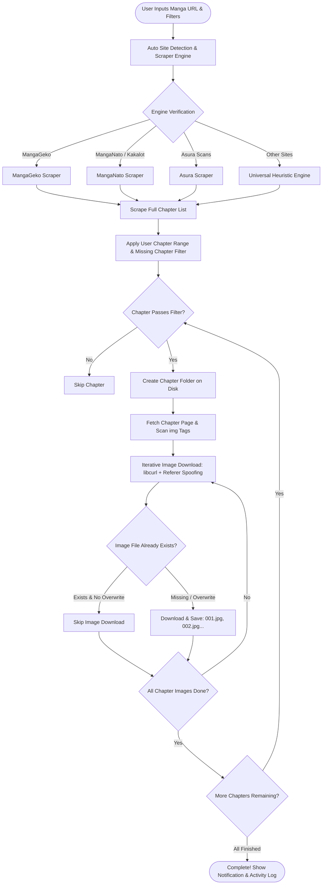

<div align="center">

  

  <br/><br/>

  <p align="center">
    
  </p>

  # ⚡ MANGA DOWNLOADER ⚡
  ### *High-Performance, Ultra-Lightweight Native Win32 Manga Archiver & AI Hub*

  <p align="center">
    <b>A Pure C Desktop Application to Automatically, Neatly, Swiftly, and Memory-Efficiently Download Entire Manga Chapters.</b>
  </p>

  <p align="center">
    <a href="README.md"></a>
    <a href="README.id.md"></a>
  </p>

  <p align="center">
    <a href="https://github.com/gcmaniac/manga_downloader"></a>
    <a href="https://github.com/gcmaniac/manga_downloader/stargazers"></a>
    <a href="#-key-features"></a>
    <a href="#️-developer-onboarding--installation-guide"></a>
    <a href="#️-developer-onboarding--installation-guide"></a>
    <a href="#️-developer-onboarding--installation-guide"></a>
    <a href="LICENSE"></a>
    <a href="#️-developer-onboarding--installation-guide"></a>
  </p>

  <p align="center">
    <a href="#-about-the-project">📖 About</a> •
    <a href="#-system-architecture--workflow">🔄 Workflow</a> •
    <a href="#-user-guide">🚀 User Guide</a> •
    <a href="#-key-features">✨ Key Features</a> •
    <a href="#️-developer-onboarding--installation-guide">🛠️ Developer Guide</a> •
    <a href="#-call-for-contributions">🤝 Contributing</a> •
    <a href="#-license">📄 License</a>
  </p>

</div>

---

## 📖 About The Project

**Manga Downloader** is a native Windows desktop application crafted specifically in **C** using the **Windows Win32 API**. It was engineered from the ground up to solve common pain points found in modern manga downloaders: *excessive RAM usage (Chromium/Electron bloatware), sluggish download speeds, and disorganized folder structures*.

With an ultra-compact binary footprint (**under 250 KB**) and minimal RAM consumption (**< 20 MB RAM**), you can archive thousands of high-resolution manga chapters to local storage with absolute peace of mind, without bogging down your laptop or PC.

### 🌟 Why Choose Manga Downloader?
* **Zero Bloatware**: Pure C implementation (no Electron, no WebView, no Python GUI runtime overhead).
* **Portable Ready**: Simply extract a single ZIP directory and run it immediately—no installers or invasive Windows registry modifications.
* **Smart Heuristics Engine**: Automatically analyzes chapter page structures and image URLs across prominent manga portals.
* **Next-Gen AI Agent Hub**: Directly integrated with an AI model catalog (OpenRouter API) for benchmarking latency, pricing per million tokens, intelligence ratings, and laying the groundwork for automated workflows.

---

## 🔄 System Architecture & Workflow

Below is the workflow architecture detailing how Manga Downloader processes everything from receiving a manga URL to storing images on disk:



### 🔍 Internal Execution Pipeline:

1. **URL Normalization & Engine Selector**
   The application extracts the base hostname and matches it against supported site patterns without heavy regex. If no specific parser matches, the *Universal Heuristic Engine* seamlessly takes over.
2. **Chapter Discovery & Indexing**
   Fetches the manga index page, parses chapter hyperlinks (`/reader/`, `/chapter-`, etc.), sorts them in proper chronological order (Chapter 1 through the latest), and deduplicates URLs.
3. **Smart Range & Missing Chapter Filtering**
   Applies user-defined range expressions (e.g., `1-10, 25, 50-end`). If *"Only find & download missing chapters"* is checked, the system inspects existing local folders to verify if valid image files already exist before skipping the chapter.
4. **Resilient Image Fetching (Anti-Hotlinking)**
   Dispatches HTTP requests impersonating genuine desktop browsers (`User-Agent Chrome Windows 10/11`) accompanied by the appropriate `Referer Header` of the chapter reader page, circumventing *HTTP 403 Forbidden* restrictions imposed by manga CDNs.
5. **Disk I/O & Real-Time Logging**
   All page download progress and chapter statuses are streamed asynchronously to the Win32 GUI log window via a dedicated `Background Worker Thread`, ensuring the user interface remains snappy and free of freezing (*Not Responding*).

---

## ✨ Key Features

| Feature | Description |
| :--- | :--- |
| **🚀 Native Win32 UI** | Blazing-fast, ultra-lightweight, battery-efficient graphical interface with zero runtime overhead. |
| **🎯 Multi-Site Scraper Engine** | Built-in support for **MangaGeko**, **MangaNato**, **MangaKakalot**, **Asura Scans**, plus a versatile **Universal Scraper** for standard web readers. |
| **🔢 Flexible Chapter Filtering** | Supports specific chapter numbers as well as arbitrary ranges: e.g., `5`, `1-10`, `25, 28, 30`, or `116-end`. |
| **🛡️ Missing Chapter Detection** | Prevents redundant downloads for ongoing series. Check this box and the archiver will only download newly released chapters! |
| **⚡ Multi-Threaded Async Worker** | Downloads execute on background threads without locking the UI, paired with a responsive **Stop** button anytime. |
| **📁 Structured Auto-Organization** | Images are neatly saved into dedicated chapter subfolders with sequential zero-padded names (`001.jpg`, `002.jpg`, ...), fully compatible with any offline manga reader. |
| **📄 Smart PDF Converter** | Convert downloaded chapters into PDF documents (per chapter or per volume). Supports automatic chapter-to-volume folder relocation and AI Agent volume text parsing. |
| **🌐 AI Manga Translator** | Vision LLM-powered visual translation pipeline. Automatically detects speech bubbles, in-paints original text, and re-typesets translated text into target languages (ID/EN/JP), with optional direct PDF generation. |
| **🔔 Sound Notifications** | Plays an audible Windows notification chime upon completion of download, PDF conversion, and translation jobs. |
| **🧠 Built-in AI Agent Hub** | Embedded SQLite-backed management interface for AI models (OpenRouter API), supporting benchmarking across hundreds of models for token pricing, latency, and capability tiers. |
| **📦 100% Portable** | Easily runs from a USB flash drive or external drive; ready out of the box on Windows 10 and Windows 11. |

---

## 🚀 User Guide

### 1. Launching the App (1-Click Ready)
* **Quick Launch**: Double-click **`Jalankan_App.bat`** or launch **`manga_downloader.exe`** directly from the root directory.
* All library dependencies (`libcurl`, `sqlite3`, `cjson`, etc.) and the SQLite database are portably packaged within the folder, running instantly without prior installation.
* For distribution to other machines, grab the standalone ZIP archive from [Releases](https://github.com/gcmaniac/manga_downloader/releases) or rebuild a fresh package using `package.bat`.

### 2. Downloading Manga (Tab 1: Home)
1. **Main Manga Link**:
   Copy the chapter list URL of the manga from your browser and paste it into the *Main Manga Link* input field.
   > Example: `https://www.mgeko.cc/manga/7322-parnf/all-chapters/`
2. **Web Status**:
   Observe the status label below the URL field. The app will immediately detect and display the appropriate scraper engine (e.g., *MangaGeko Engine [Supported]*).
3. **Output Directory**:
   Click **Browse...** to choose a target folder on your system (or click **Default** to use the local `downloads` directory).
4. **Select Chapters (Optional)**:
   * Leave blank to download **all available chapters from first to last**.
   * Specify desired chapters using flexible expressions:
     * `1-10` : Downloads Chapter 1 through Chapter 10.
     * `5, 12, 20` : Downloads Chapters 5, 12, and 20 only.
     * `100-end` : Downloads from Chapter 100 up to the newest released chapter.
5. **Additional Options**:
   * Check **"Only find & download chapters not present in folder"** to pull only new updates without re-downloading existing chapters.
   * Check **"Overwrite files if they already exist"** only when you need to replace existing image files.
6. **Start Download**:
   * Click **Start Download**.
   * Monitor live progress and statistics directly in the **Activity Log** window.
   * You can cancel or pause the process at any moment by clicking **Stop**.

---

### 3. Converting to PDF (Tab 2: PDF Converter)
* Choose between **Per Chapter (1 PDF per chapter)** or **Per Volume (1 PDF per volume)**.
* Organize chapters by volume using custom volume lists or fixed chapter counts per volume.
* Automatically moves chapters into structured volume folders and generates standardized PDF books.

---

### 4. Translating Manga (Tab 3: Manga Translator)
* **Visual Manga Translation Pipeline**:
  1. Select the folder containing downloaded chapter subfolders.
  2. Choose your target translation language (**Bahasa Indonesia**, **English**, or **Japanese**).
  3. Filter chapters to translate (e.g. `1-5`).
  4. Options:
     * **Keep original translated images**: Saves modified pages into `[Target Folder]\Chapter XXX [ID]\...`
     * **Compile to PDF directly**: Automatically merges the translated pages into a clean chapter PDF book.
  5. The Vision LLM (`server_agent` + `model_penggunaan`) reads each page, identifies bubble locations, masks out the original text, and typesets the new translated text neatly with auto-fitted fonts.

#### ⚠️ Known Limitations & Constraints of the Translation Pipeline:
* **Vision Model Requirement**: Requires a Multimodal/Vision-capable LLM registered in your active model roster. Text-only models cannot detect speech bubbles. Free models on OpenRouter may experience rate limits, price changes, or temporary downtime (the app includes automatic failover to fallback models in Tab 6).
* **Speech Bubble In-Painting**: Works best on standard speech bubbles with white or uniform solid backgrounds. Text placed directly over intricate art, dark shading, screentones, or gradient backgrounds (*text over art*) may result in visible solid masking patches.
* **Hand-Drawn SFX / Onomatopoeia**: Stylized sound effects (Japanese *sfx*, *katakana* drawn across action panels) are not standard dialogue bubbles and are typically skipped by the detector.
* **Vertical vs. Horizontal Typesetting**: Traditional Japanese manga uses vertical text flow (top-to-bottom). Target translations (English/Indonesian) are typeset horizontally (LTR). On tall, extremely narrow vertical bubbles, font size auto-scaling may decrease font dimensions to ensure text fits within the bounding box.
* **Network & Image Latency**: Each page is transmitted as Base64 to the Vision LLM endpoint. Processing speed depends on your internet bandwidth and the selected model's inference speed (typically 2–5 seconds per page). Very long continuous webtoon strips may require downscaling or take longer to process.

---

### 5. Exploring the AI Hub (Tabs 4, 5, & 6)

The application includes an advanced SQLite-powered AI evaluation workspace for benchmarks and automation:

* **Tab 4 (AI Settings & Benchmark)**:
  * Enter your API Key from [OpenRouter](https://openrouter.ai/).
  * Click **Scan & Update Models**. The application retrieves the complete catalog of models, calculates estimated latency, and logs input/output token pricing.
  * Sort models by Rating, Latency, or Pricing tiers.
* **Tab 5 (Tested Model Catalog)**:
  * Filter models by price boundaries or rating thresholds.
  * Pick the top-performing model and register it into your active operational roster by clicking **Use This Model**.
* **Tab 6 (Active AI Models)**:
  * Organize priority order and manage active models configured for chapter text translation and analysis tasks.

---

## 🛠️ Developer Onboarding & Installation Guide

Welcome to the **Manga Downloader** development team! This guide walks you through setting up a complete native C Windows development environment from a clean `git clone` to running and modifying the application.

### 📋 Prerequisites & System Requirements

* **Operating System**: Windows 10 or Windows 11 (64-bit recommended).
* **Git**: [Git for Windows](https://git-scm.com/) installed and available in Command Prompt or PowerShell.
* **Terminal**: Windows Terminal, Command Prompt (`cmd.exe`), or PowerShell.

---

### 📦 Development Toolchain & Dependencies

Manga Downloader is built with **pure C99** targeting native **Win32 API** without heavy frameworks. To compile, you need the **MSYS2 MinGW-w64 (64-bit)** toolchain.

#### 1. Required Libraries & Packages

| Package Name | Purpose | Installation Command |
| :--- | :--- | :--- |
| **`mingw-w64-x86_64-toolchain`** | GNU C Compiler (`gcc`), Resource Compiler (`windres`), Binutils, Make | `pacman -S mingw-w64-x86_64-toolchain` |
| **`mingw-w64-x86_64-curl`** | Network fetching, custom headers, referer spoofing, anti-hotlinking | `pacman -S mingw-w64-x86_64-curl` |
| **`mingw-w64-x86_64-sqlite3`** | AI model catalog database, latency benchmarks, ratings storage | `pacman -S mingw-w64-x86_64-sqlite3` |
| **`mingw-w64-x86_64-cjson`** | Ultra-lightweight JSON parser for OpenRouter API & i18n language files | `pacman -S mingw-w64-x86_64-cjson` |
| **Windows Native SDK** | Win32 GUI (`comctl32`), GDI (`gdi32`), WIC (`windowscodecs`), Shell (`shell32`), COM (`ole32`, `oleaut32`) | Pre-installed with MinGW CRT & Windows |

---

### 🚀 Step-by-Step Installation for New Developers

Follow these exact steps when cloning this repository for the first time:

#### Step 1: Install MSYS2
1. Download and install MSYS2 from the official website: **[https://www.msys2.org/](https://www.msys2.org/)**.
2. Recommended installation path: `C:\msys64` (default).

#### Step 2: Install Compiler Toolchain & Libraries
Open the **MSYS2 MinGW x64** terminal (search for *"MSYS2 MinGW 64-bit"* in Windows Start Menu) and run:
```bash
pacman -Syu --noconfirm
pacman -S --needed --noconfirm base-devel mingw-w64-x86_64-toolchain mingw-w64-x86_64-curl mingw-w64-x86_64-sqlite3 mingw-w64-x86_64-cjson
```

#### Step 3: Add MinGW64 to Windows System PATH
To allow `build.bat` and Windows CMD/PowerShell to find `gcc` and `windres`:
1. Press `Win + R`, type `sysdm.cpl`, and press Enter.
2. Navigate to the **Advanced** tab -> click **Environment Variables**.
3. Under **System variables** (or **User variables**), select `Path` and click **Edit**.
4. Click **New** and add:
   ```text
   C:\msys64\mingw64\bin
   ```
5. Click **OK** on all windows to apply.
6. Open a fresh Command Prompt (`cmd.exe`) or PowerShell and verify:
   ```cmd
   gcc --version
   windres --version
   ```
   *(Both commands should report GCC and GNU Binutils version 12+ or 13+).*

#### Step 4: Clone the Repository
Clone the repository using Git and navigate into the project root:
```cmd
git clone https://github.com/gcmaniac/manga_downloader.git
cd manga_downloader
```

#### Step 5: Build the Application
Run the automated build script:
```cmd
build.bat
```

What `build.bat` executes under the hood:
1. **Auto-Detects Environment**: Inspects system `PATH` and common MSYS2 installation directories (`C:\msys64\mingw64`, `D:\msys64\mingw64`, `E:\msys64\mingw64`).
2. **Compiles Resources**: Generates `dist\resources.o` from `resources.rc` containing high-res icons and Windows Visual Styles manifest.
3. **Compiles C Modules**: Compiles all source files in `src/` and `src/scrapers/` using `-Wall -O2` optimization into `dist\manga_downloader.exe`.
4. **Deploys Runtime Dependencies**: Automatically copies required runtime DLLs (`libcurl-4.dll`, `libsqlite3-0.dll`, `libcjson-1.dll`, etc.), language JSON files (`src\lang\*.json`), and the SQLite database into `dist\`.

#### Step 6: Launch & Verify
You can immediately launch the application:
* Using the launcher script:
  ```cmd
  Jalankan_App.bat
  ```
* Or launching directly from the distribution directory:
  ```cmd
  dist\manga_downloader.exe
  ```

---

### 🏗️ Project Architecture & Directory Structure

To help you navigate the codebase quickly:

```text
manga_downloader/
├── assets/                    # Graphical assets (banners, app logo .ico, .png)
├── dist/                      # Build output folder (executable, runtime DLLs, SQLite DB, lang/)
│   ├── manga_downloader.exe   # Compiled dynamic Win32 executable
│   ├── manga_downloader.db    # Embedded SQLite database (AI models & benchmarks)
│   ├── config.ini             # App configuration (selected language, API keys, download folder)
│   └── lang/                  # Deployed localization JSON files
├── downloads/                 # Default destination folder for downloaded chapters
├── src/                       # Application source code (C99 / Win32)
│   ├── main.c                 # Win32 GUI, Tab control, event loops, worker threads
│   ├── ai_agent.c             # AI Hub, OpenRouter API client, latency benchmark, failover engine
│   ├── pdf_converter.c        # Native Windows GDI/WIC PDF rendering engine (chapter & volume)
│   ├── manga_translator.c     # Vision LLM translation pipeline, bubble detection & typesetting
│   ├── db_migration.c         # SQLite database schema migration and initialization
│   ├── config.c               # Portable settings loader & saver (config.ini)
│   ├── lang.c                 # Multi-language internationalization loader (JSON i18n)
│   ├── lang/                  # Source language definition files
│   │   ├── id.json            # Indonesian language strings
│   │   ├── en.json            # English language strings
│   │   └── ja.json            # Japanese language strings
│   └── scrapers/              # Modular scraper engine parsers
│       ├── scrapers.h         # Common scraper interface, types, and definitions
│       ├── scrapers.c         # Scraper dispatcher and shared HTML parsing utilities
│       ├── scraper_manganato.c# Parser for Manganato & MangaKakalot
│       ├── scraper_mgeko.c    # Parser for MangaGeko
│       ├── scraper_asura.c    # Parser for Asura Scans
│       └── scraper_generic.c  # Universal heuristic scraper for unlisted web readers
├── build.bat                  # Primary Windows compilation script
├── package.bat                # Portable ZIP bundler script
├── Jalankan_App.bat           # 1-Click launcher script
├── resources.rc               # Windows application resource file (app icon & manifest)
└── LICENSE                    # Open Source MIT License
```

---

### ⚙️ Build Options & Advanced Targets

| Command | Output | Description |
| :--- | :--- | :--- |
| `build.bat` | `dist\manga_downloader.exe` | Standard dynamic build with bundled DLLs. Fast compile time (~3-5s). |
| `build.bat --static` | `dist\manga_downloader_standalone.exe` | Fully static standalone binary. Contains all libraries statically linked. Zero external DLL dependencies. |
| `build.bat --no-pause` | `dist\manga_downloader.exe` | Build without prompt pause (ideal for CI/CD or automated scripts). |
| `package.bat` | `dist\manga_downloader_portable.zip` | Compiles and packages the entire portable release ready for distribution. |

---

### 🧩 How to Add New Features (Contribute)

#### Adding a New Scraper:
1. Create a new source file in `src/scrapers/scraper_<sitename>.c`.
2. Implement chapter extraction and image URL extraction functions adhering to `ScraperEngine` in `src/scrapers/scrapers.h`.
3. Register the scraper in `src/scrapers/scrapers.c` and in the URL detector in `src/main.c`.
4. Add the new source file to `set SRCS=...` in `build.bat`.

#### Adding a New Interface Language:
1. Create a new translation file `src/lang/<code>.json` (e.g., `es.json` for Spanish).
2. Translate the string keys matching `src/lang/en.json`.
3. Register the new language code in `src/lang.c` and `src/main.c`.

---

### ❓ Troubleshooting & Common Build Issues

#### 1. `'gcc' is not recognized as an internal or external command`
* **Cause**: MinGW `bin` directory is missing from your system `PATH`.
* **Fix**: Ensure `C:\msys64\mingw64\bin` is added to your environment `PATH` and restart your terminal.

#### 2. `fatal error: curl/curl.h: No such file or directory` (or `sqlite3.h` / `cjson/cJSON.h`)
* **Cause**: Required development headers are missing.
* **Fix**: Open MSYS2 MinGW 64-bit terminal and run:
  ```bash
  pacman -S mingw-w64-x86_64-curl mingw-w64-x86_64-sqlite3 mingw-w64-x86_64-cjson
  ```

#### 3. Application crashes or complains about missing DLLs on launch
* **Cause**: Running `manga_downloader.exe` outside the `dist/` directory where runtime DLLs reside.
* **Fix**: Always execute from the `dist/` directory or run using `Jalankan_App.bat`.

#### 4. Model requests fail or return `unavailable for free`
* **Cause**: OpenRouter model tier changes or temporary rate limiting.
* **Fix**: Use Tab 4 to rescan models or pick an available active model in Tab 5/6. The built-in failover engine will automatically fall back to the next registered active model.

---

## 🤝 Call for Contributions

<div align="center">
  <h3>🌸 Let's Build Together with the Open Source Community! 🌸</h3>
  <p>
    <i>"This project is built with dedication to simplicity, performance, and the freedom to archive your favorite manga."</i>
  </p>
</div>

We warmly welcome contributions from everyone—beginners, C enthusiasts, and seasoned developers alike—to help shape **Manga Downloader**!

### 💡 Ideas & Areas for Contribution:
- [x] **New Site Scrapers**: Built-in support for MangaGeko, MangaNato, and Asura Scans. (More sites welcome!)
- [x] **PDF Export**: Native high-speed PDF creation per-chapter and per-volume with automatic chapter organization.
- [x] **AI-Powered OCR & Visual Translator**: Vision LLM pipeline with bubble detection, text removal, and in-place translation typesetting.
- [x] **GUI Localization**: Multi-language support (English, Indonesian, Japanese) loaded dynamically from JSON.
- [ ] **Multi-threaded Worker Pool**: Accelerate downloads by fetching multiple images or chapters in parallel.
- [ ] **Dark Mode Win32 Theme**: Implement a sleek, native dark theme for the Win32 window and controls.
- [ ] **CBZ Comic Archive Export**: Direct zip/cbz compression option alongside PDF.

### 🛠️ Contribution Workflow (Pull Request):
1. **[Fork](https://github.com/gcmaniac/manga_downloader/fork)** this repository to your GitHub account.
2. Create a descriptive feature branch:
   ```bash
   git checkout -b feature/add-new-manga-scraper
   ```
3. Make your code changes and ensure the project builds cleanly via `build.bat`:
   ```cmd
   build.bat
   ```
4. Commit your changes with clear messages:
   ```bash
   git commit -m "feat: Add scraper engine for MangaPortalXYZ"
   ```
5. Push the branch to your fork:
   ```bash
   git push origin feature/add-new-manga-scraper
   ```
6. Open a **[Pull Request](https://github.com/gcmaniac/manga_downloader/pulls)** on GitHub explaining your proposed changes. We'll be thrilled to review and merge them!

Found a bug or have a suggestion? Feel free to open a **[New GitHub Issue](https://github.com/gcmaniac/manga_downloader/issues)**!

---

## ⚖️ Disclaimer & Usage Ethics

This project is intended strictly for educational purposes, study of low-level systems programming in C & Win32 API, and personal offline archiving. Please continue to support manga authors, illustrators, and official publishers by purchasing original volumes, merchandise, and subscribing to licensed platforms.

---

## 📄 License

This project is licensed under the **[MIT License](LICENSE)**. You are free to use, modify, and distribute it for both personal and commercial purposes, provided the original copyright notice and permission notice are preserved.

---

<div align="center">
  <sub>Crafted with ❤️ and dedication by <a href="https://github.com/gcmaniac"><b>gcmaniac</b></a> and the Open Source Manga Community.</sub><br/><br/>
  <b>⭐ If you find this project useful, don't forget to give it a <a href="https://github.com/gcmaniac/manga_downloader">Star on GitHub</a>! ⭐</b>
</div>
